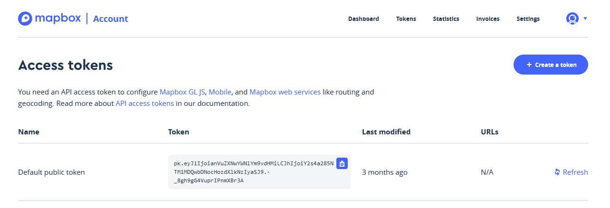

# Getting Set Up

This page will walk you through how to access Python, download the lab data, and install/setup a geocoding package,

## Step 1) 

Start Python - UBC provides server space where you can run Python using a [Jupyter Notebook](https://ubc.syzygy.ca/jupyter)
* Login with your CWL.  You'll then be taken to a blank jupyter window.
* This is good option for getting your bearings because nearly everything is already set up.
  * You don't have to worry about installing anything on your own computer.
* This may sound intimidating/confusing.  But don't worry, its easy.  You don't need to know command line to do this.  I'll walk you through step by step!!

## Step 2)

 Open a command terminal.  In the Jupyter window, click "New" in the top right and select "Terminal" from the dropdown menu.

## Step 3) 

Clone the repository.  In the new terminal window that opens, paste the command:
```
  https://github.com/June-Skeeter/GEOB270_Lab4_2021S1
```
* Hit enter and the flies will download after a few seconds.  This tells Git (a file tracking software) to to download a repository for this workshop with all the files and code.


## Setp 4) Installing geopy

In the terminal window type:
```
    pip install geopy
```
* Hit enter to install the geopy package. 

## Step 5)
Go back to your Jupyter Notebook window.  Double click to open the GEOB270_Lab4_2021S1 folder that wasa just download.
* You'll see a two more folders and a collection of files.  The .ipynb tag on the end denotes a Jupyter "Notebook"
  * A Notebook is a collection of Python code and annotations that can be run interactively.
  * Double click on "Geocoding with Python.ipynb" to open it.

## Step 6) 
Create a [Mapbox](https://mapbox.com) accont.  We need this to access our API key later.  Then you can [access token here](https://account.mapbox.com/access-tokens/)
* On this page, you should see a "Default Public Token".  This will be the key we use to access Mapbox's geocoding service.  Leave this tab open for now and go on to the next page.


